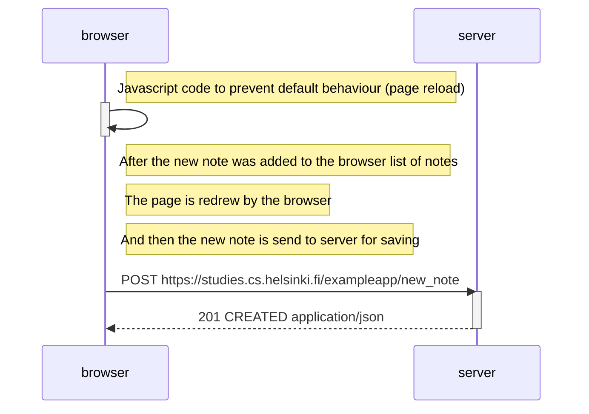

```mermaid
sequenceDiagram
    Note right of browser: Javascript code to prevent default behaviour (page reload)

    participant browser
    participant server
    
    activate browser
    browser->>browser: 
    deactivate browser

    Note right of browser: After the new note was added to the browser list of notes
    Note right of browser: The page is redrew by the browser
    Note right of browser: And then the new note is send to server for saving

    browser->>server: POST https://studies.cs.helsinki.fi/exampleapp/new_note
    activate server
    server-->>browser: 201 CREATED application/json
    deactivate server
```